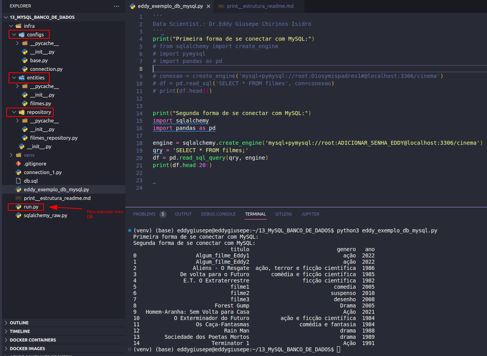

# SQLAlchemy 

Este estudo, de Banco de Dados, está baseado no PlayList do [Programador Lhama](https://www.youtube.com/watch?v=to39SFUxOpg&list=PLAgbpJQADBGKbwhOvd9DVWy-xhA1KEGm1).

Com esta playlist conseguimos conectar com nosso Banco de Dados MySQL e uma organização de diretórios de nossos scripts, as quais contém as entidades, classes, ... de nosso Banco de Dados.

A seguir adicionamos alguns prints para acompanhar a estrutura que foi desenvolvida:

